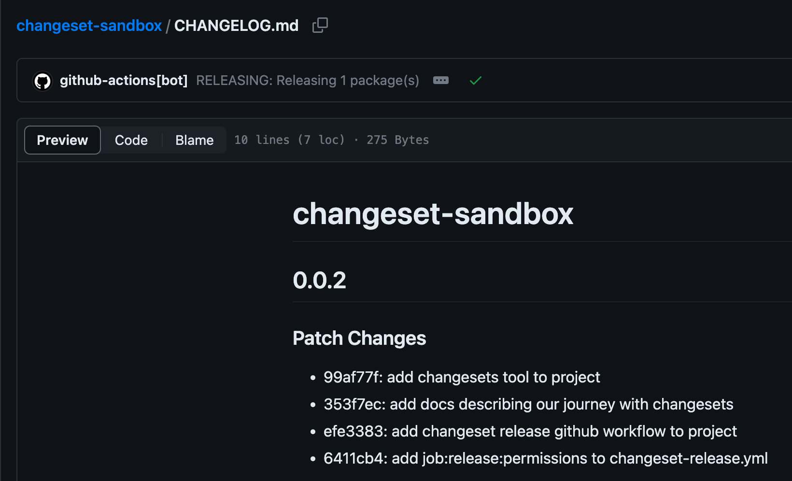

# STEPS TAKEN

## Installing

View the
[changesets project on GitHub](https://github.com/changesets/changesets/tree/main)

Install the changeset tool:

```sh
yarn add @changesets/cli && yarn changeset init
git add .changeset/ package.json yarn.lock
git commit -m "add the changeset tool"
```

Tweak the config:

Edit [changeset/config.json](.changeset/config.json) and set:

```json
  "commit": true,
```

Then:

```sh
git commit -m "update changeset tool to auto-commit" .changeset/config.json
```

## Enable The Bot

Visit [changeset-bot](https://github.com/apps/changeset-bot)
and "_Configure_" as desired:

- some projects
- all projects

## New Branch

So we can see things taking shape, we'll add our first changeset fragments, and
workflows in a branch.

```sh
git checkout -b changesets
```

We will automate based on
[this document](https://github.com/changesets/changesets/blob/main/docs/automating-changesets.md).

We create `.github/workflows/changeset-release.yml` based on
[Example Workflow Without Publishing](https://github.com/changesets/action#without-publishing).

We add it to git:

```sh
git add .github/workflows/changeset-release.yml
git commit -m "add Changeset Release workflow"
```

Before we create our first changeset, we need to fix `package.json`:

```sh
yarn init
git commit -m "update package configuration" package.json
```

To make our first change entry, we'll run `yarn changeset`. We run it once with
each of these messages:

- `add changesets tool to project`
- `add changeset release github workflow to project`


We confirm that these have been automatically added to git:

```sh
❯ git log --no-decorate --oneline -n2
efe3383 docs(changeset): add changeset release github workflow to project
99af77f docs(changeset): add changesets tool to project
```

We then check things out by pushing our new branch:

```sh
git push -u origin changesets:changesets
```

We then
[follow the link](https://github.com/chizmw/changeset-sandbox/pull/new/changesets)
to create a new PR.

Shortly after creating the
[PR](https://github.com/chizmw/changeset-sandbox/pull/1),
we see a comment from the bot:


To understand the behaviour with minimal customisations we "Merge Pull Request"
(Create a merge commit)

[This failed](https://github.com/chizmw/changeset-sandbox/actions/runs/5533364092/jobs/10096785328)


### Fixes

Firstly, we needed to add some permissions to the workflow job:

```yaml
# IMPORTANT: prevent this action from running on forks
if: github.repository == 'chizmw/changelog-github-without-thanks'
permissions:
  contents: write # to create release (changesets/action)
  pull-requests: write # to create pull request (changesets/action)
```

Secondly, we needed to allow GitHub Actions to create or approve pull requests.

This option can be found in:

> (Project) Settings » Actions » General » Allow Github Actions to create and
> approve pull requests

With these changes, the workflow completes successfully after a PR is merged.

With our current setup we arrive at
[PR#4](https://github.com/chizmw/changeset-sandbox/pull/4)


We merge this to see what happens next...

## After The Merge

After merging the PR we now have a
[CHANGELOG.md](https://github.com/chizmw/changeset-sandbox/blob/f7d31cdbedd7ff496266e8310f906cf760868c9a/CHANGELOG.md).

Weirdly, we don't have version 0.0.1. It's possible that we could have avoided
this by starting our initial `package.json` with version `0.0.0`, or maybe we
did something wrong to get where we are now.

Nonetheless, it's a good start!


